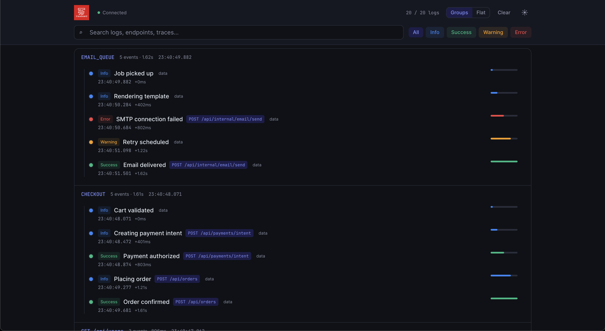
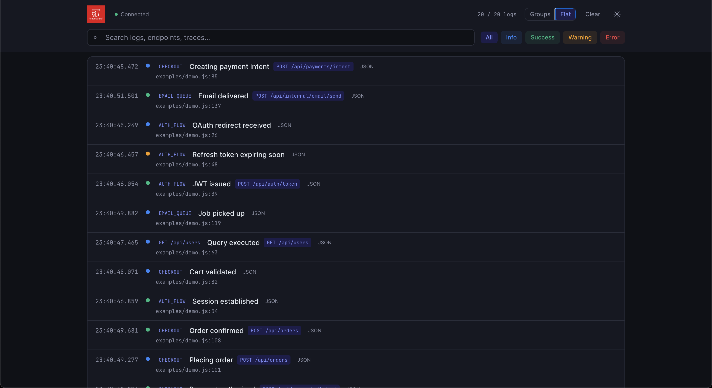
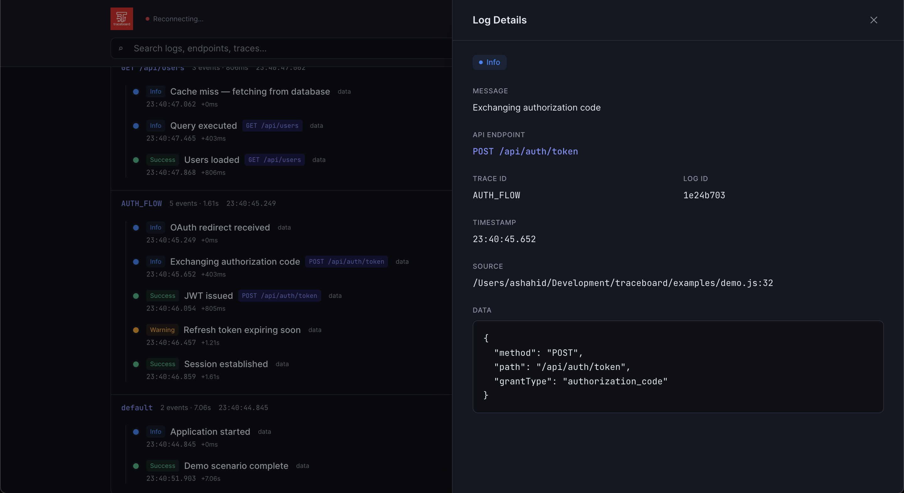

<p align="center">
  
</p>

<h1 align="center">traceboard</h1>

<p align="center">
  A lightweight local debugging dashboard for Node.js — stream structured trace logs to a realtime browser UI.
</p>

<p align="center">
  <a href="https://www.npmjs.com/package/traceboard"></a>
  <a href="https://www.npmjs.com/package/traceboard"></a>
  <a href="https://nodejs.org"></a>
</p>

---

## Table of contents

- [Installation](#installation)
- [Usage](#usage)
- [Results](#results)
- [Configuration](#configuration)
- [Contributing](#contributing)
- [License](#license)

---

## Installation

### Prerequisites

- [Node.js](https://nodejs.org/) **18** or later
- npm, yarn, or pnpm

### Install the package

Add traceboard to your project:

```bash
npm install traceboard
```

Or with other package managers:

```bash
yarn add traceboard
```

```bash
pnpm add traceboard
```

### Start the dashboard

Open a terminal and run:

```bash
npx traceboard
```

This starts the local server and opens the dashboard at **http://localhost:4287**.

To install the CLI globally:

```bash
npm install -g traceboard
traceboard
```

### Try the demo (optional)

Clone the repo and run the included demo to populate the dashboard with sample data:

```bash
git clone https://github.com/iabdullahshahid/traceboard.git
cd traceboard
npm install
cp .env.example .env
npx traceboard          # Terminal 1
npm run demo            # Terminal 2
```

---

## Usage

Import `trace` in your Node.js app. Logs stream to the dashboard in realtime — nothing is printed to your terminal.

### ESM (recommended)

```ts
import { trace } from "traceboard";
```

### CommonJS

```js
const { trace } = require("traceboard");
```

---

### 1. Log levels

traceboard supports four log levels. Each appears with a distinct color in the dashboard.

```ts
import { trace } from "traceboard";

// General information
trace.info("Server listening", { port: 3000 });

// Successful operations
trace.success("User created", { userId: "usr_8k2m9x" });

// Non-fatal issues
trace.warning("Rate limit approaching", { remaining: 5 });

// Failures and exceptions
trace.error("Payment declined", { code: "CARD_DECLINED" });
```

| Method | Type | Use for |
|---|---|---|
| `trace.info()` | Info | General events, debugging context |
| `trace.success()` | Success | Completed operations, happy paths |
| `trace.warning()` | Warning | Deprecations, retries, soft failures |
| `trace.error()` | Error | Exceptions, failed requests, hard errors |

---

### 2. Message only

Logs accept just a message — no data payload required.

```ts
trace.info("Application started");
trace.success("Build completed");
trace.warning("Using fallback cache");
trace.error("Connection refused");
```

---

### 3. Message with data

Attach any JSON-serializable object. It appears in the detail drawer when you click a log entry.

```ts
trace.info("User loaded", {
  userId: 42,
  email: "dev@example.com",
  roles: ["admin", "editor"],
});

trace.success("Order placed", {
  orderId: "ord_7p4q1w",
  total: 149.97,
  currency: "USD",
});
```

---

### 4. Trace groups

Group related logs under a shared trace ID. Ideal for auth flows, API handlers, checkout pipelines, or background jobs.

```ts
const auth = trace.group("AUTH_FLOW");

auth.info("OAuth redirect received", { provider: "google" });
auth.info("Exchanging authorization code");
auth.success("JWT issued", { expiresIn: 3600 });
auth.warning("Refresh token expiring soon", { remaining: 300 });
auth.success("Session established", { userId: "usr_8k2m9x" });
```

Nested groups are supported — call `.group()` on any logger:

```ts
const checkout = trace.group("CHECKOUT");
const payment = checkout.group("PAYMENT");

payment.info("Creating payment intent", { amount: 149.97 });
payment.success("Payment authorized", { paymentId: "pi_3Nx8k2m" });
checkout.success("Order confirmed", { orderId: "ord_7p4q1w" });
```

---

### 5. HTTP / API tracing

Pass `method` and `path` in the **second argument** (the data object). traceboard uses these to:

- Show an **endpoint badge** on the log row (e.g. `POST /api/auth/token`)
- Display a highlighted **API Endpoint** field when you click the log
- Render the full **Data** JSON in the detail drawer

This is exactly how the demo script logs endpoints:

```ts
const auth = trace.group("AUTH_FLOW");

auth.info("Exchanging authorization code", {
  method: "POST",
  path: "/api/auth/token",
  grantType: "authorization_code",
});

auth.success("JWT issued", {
  method: "POST",
  path: "/api/auth/token",
  status: 200,
  expiresIn: 3600,
  userId: "usr_8k2m9x",
});
```

When you click **"Exchanging authorization code"** in the dashboard, the detail drawer shows:

| Field | Example value |
|---|---|
| Message | Exchanging authorization code |
| API Endpoint | `POST /api/auth/token` |
| Trace ID | `AUTH_FLOW` |
| Source | `examples/demo.js:32` |
| Data | Full JSON payload (see below) |

```json
{
  "method": "POST",
  "path": "/api/auth/token",
  "grantType": "authorization_code"
}
```

#### Supported endpoint fields

traceboard detects endpoints from any of these keys in the data object:

| Key | Example |
|---|---|
| `method` + `path` | `{ method: "GET", path: "/api/users" }` |
| `method` + `url` | `{ method: "POST", url: "/api/orders" }` |
| `method` + `endpoint` | `{ method: "PUT", endpoint: "/api/users/1" }` |
| `method` + `route` | `{ method: "DELETE", route: "/api/session" }` |
| `httpMethod` + `path` | `{ httpMethod: "PATCH", path: "/api/profile" }` |
| nested `request` | `{ request: { method: "GET", path: "/api/health" } }` |

The badge and detail drawer display the endpoint as **`METHOD path`** (e.g. `GET /api/users`).

#### More examples

```ts
trace.success("GET /api/users", {
  method: "GET",
  path: "/api/users",
  status: 200,
  durationMs: 142,
});

trace.info("Creating payment intent", {
  method: "POST",
  path: "/api/payments/intent",
  amount: 149.97,
  currency: "USD",
});

trace.error("SMTP connection failed", {
  method: "POST",
  path: "/api/internal/email/send",
  status: 503,
  retryIn: 30,
});
```

> **Tip:** Include any extra context (`status`, `durationMs`, `query`, `userId`, etc.) in the same data object — it all appears in the **Data** panel when you click the log.

---

### 6. Errors and complex objects

Errors, circular references, functions, and bigints are serialized safely — the SDK never crashes your app.

```ts
try {
  await processPayment(order);
} catch (err) {
  trace.error("Payment processing failed", {
    error: err,
    orderId: order.id,
    attempt: 2,
  });
}
```

---

### Full example

```ts
import { trace } from "traceboard";

trace.info("Application started", { env: "development", version: "1.0.0" });

const api = trace.group("GET /api/users");

api.info("Cache miss — fetching from database");
api.info("Query executed", {
  method: "GET",
  path: "/api/users",
  query: { page: 1, limit: 20 },
});
api.success("Users loaded", {
  method: "GET",
  path: "/api/users",
  status: 200,
  count: 20,
  durationMs: 142,
});
```

> **Note:** The SDK connects lazily on the first log call. If the dashboard is not running, your app continues normally — logs are silently dropped.

---

## Results

Run `npx traceboard` and `npm run demo` to reproduce the screenshots below.

### Groups view — timeline by trace ID

Logs are grouped by trace (e.g. `AUTH_FLOW`, `CHECKOUT`, `EMAIL_QUEUE`) with a visual timeline, relative timing, and endpoint badges.

<p align="center">
  
</p>

### Flat view — chronological log stream

Switch to **Flat** for a single chronological list with trace IDs, source file locations, and filterable log levels.

<p align="center">
  
</p>

### Detail drawer — click any log to inspect

Click a log entry to open the detail drawer on the right. Endpoint logs show the **API Endpoint** field, source file/line, and the full JSON **Data** payload — matching the demo at `examples/demo.js`.

<p align="center">
  
</p>

---

## Configuration

| Variable | Default | Description |
|---|---|---|
| `TRACEBOARD_PORT` | `4287` | Port the dashboard server listens on |
| `TRACEBOARD_HOST` | `http://localhost` | Host the SDK connects to |

```bash
TRACEBOARD_PORT=5000 npx traceboard
```

```bash
TRACEBOARD_PORT=5000 TRACEBOARD_HOST=http://localhost node your-app.js
```

### Log entry shape

Every log sent to the dashboard includes:

```ts
{
  id: string;
  traceId: string;
  timestamp: number;
  type: "info" | "success" | "warning" | "error";
  message: string;
  data?: unknown;
  source: { file: string; line: number };
}
```

---

## Contributing

Contributions are welcome. Please follow these steps:

### 1. Fork and clone

```bash
git clone https://github.com/<your-username>/traceboard.git
cd traceboard
npm install
cd dashboard && npm install && cd ..
```

### 2. Create a branch

```bash
git checkout -b feat/your-feature
```

### 3. Make your changes

- **Server / SDK** — `src/`
- **Dashboard UI** — `dashboard/src/`
- **Demo script** — `examples/demo.js`

### 4. Build and verify

```bash
npm run build
```

Run the dashboard and demo to confirm everything works:

```bash
cp .env.example .env
npx traceboard          # Terminal 1
npm run demo            # Terminal 2
```

For dashboard UI development with hot reload:

```bash
npm run dev:dashboard   # Terminal 1 — Vite on :5173
npm run dev             # Terminal 2 — server on :4287
```

### 5. Open a pull request

1. Push your branch to your fork
2. Open a PR against `main` on [iabdullahshahid/traceboard](https://github.com/iabdullahshahid/traceboard)
3. Describe what changed and why
4. Ensure CI passes (build workflow runs on every PR)

### Guidelines

- Keep changes focused — one feature or fix per PR
- Match existing code style and naming conventions
- Do not commit `.env` files or `node_modules/`
- Update the README if you add user-facing features

### Reporting issues

Found a bug or have a feature request? [Open an issue](https://github.com/iabdullahshahid/traceboard/issues) with steps to reproduce or a clear description of the proposed change.

---

## License

MIT
